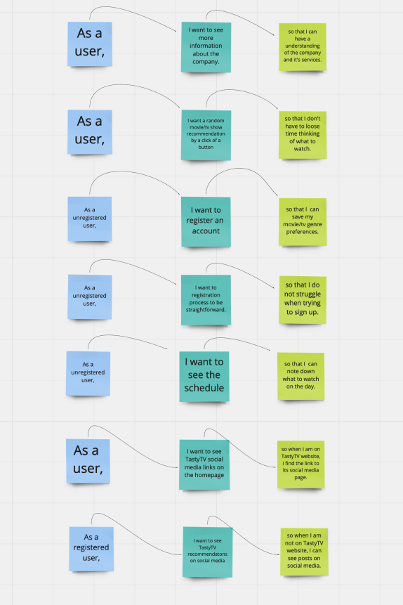
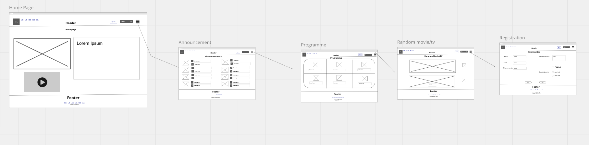

# Project - TastyTV

> TastyTV is a movie and tv show live-streaming service.Client requires promotional website to pubicisize the company and its offerings.
> Live demo [_here_](https://1jyqr.csb.app/).

## Table of Contents

- [General Info](#general-information)
- [Technologies Used](#technologies-used)
- [Features](#features)
- [Screenshots](#screenshots)
- [Setup](#setup)
- [Usage](#usage)
- [Project Status](#project-status)
- [Room for Improvement](#room-for-improvement)
- [Acknowledgements](#acknowledgements)
- [Contact](#contact)

## General Information

# Introduction

Project is to create a site that will help users discover movies and tv shows.
The main aspects it intends to solve when creating the website is to promote the company and its services.

# Project purpose

Requrements see below:-

- Display information about the company and social links (Home page).
- Proggramme stream schedule twelve hourly (Programme page). - Regular announcements.
  Further to above,see following:-
- Special feature, which allows people to get a random tasty movie reccomendation from client collection. - Website links to clients social media accounts on youtube, instagram, twitter, facebook and linkedin.

- Wireframes and User Stories see below
  > [_here_](https://miro.com/welcomeonboard/eEtWTWxKMmhXcjA1bDVPYXpPVEdVYW1ZaFlnUHN1eERJam1IaUQzRXdqS3o2NFZXT2ZjNlpnamd5a1h1WGFBbnwzMDc0NDU3MzYzNTg5OTQ3NDMx?invite_link_id=699842500565).

## Screenshots

## Technologies Used

- HTML - version: 5.0
- CSS - version: 3.0
- JavaScript: version ES6

## Features

List the ready features here:

- Links to social media accounts when clicked opens the link in a new tab.
- Provides a random movie suggestion when clicked.
- Once registered a message appears at the bottom of the page.
- Clear the registration form if user needs to start again.

## Setup

Where is it located?

> Web link [_here_](https://1jyqr.csb.app/).
> CodeSandbox link [_here_](https://codesandbox.io/s/project-tastytv-sp-1jyqr).

## Planning Stage

- With reference to client brief, a wireframe and user story was created.
- I looked at class tutorials, metacritic, apple and imdb for conceptual ideas (streaming sites not promotional).
- Sitmap starts with the Homepage (static) which will connect:-
  - Announcement
  - Programme
  - Random movie page
  - Registration
    As well as including the client initial requirements. The wireframe includes some extras such as the burger menu, sign in button, search feature etc.

## Development Stage

#Retrospective
18/10/21

1. What have you done so far

- Created stories based from the client brief.
- If the client wants extra features will need to make relevant changes and deviate from original wireframe design.
- Made the README html, css, javaScript files.
- src folder for the javscript and CSS files.
- Assets folder for images and videos.

2. What are you going to work on next

- Currently working on the template of the header, footer and transfer it on all html pages. Working on the styling in terms of grid layout.
- Look into random and programme page to implement functions and arrays with reference to the sample data.

19/10/21

1. What have you done so far

- Header and footer template so its the same on all pages.
- Correct layout of header and footer.
- Worked on grid container and flex.
- Created the container for homepage.
  - Review what's needed and extras not needed(till functionality is met).
  - The company info and social links on homepage only.
  - Worked on announcement page use same format of grid and container.
  - Some differences in image and text layout compared to origial wireframe.

2. What are you going to work on next

- Add content to remaining pages.
- Look into random and programme page to implement functions and arrays with reference to the sample data.
- Registration form needs to include fields, text areas and buttons.

3. What blockers you have (if any)

- Issue when creating the grid area unable to see the result, inspected the area and found the it was labelled as header and not a div so in turn the css notation was wrong. So corrected the label to header with the correct css notation.
  - When setting up the grid, had an issue with the header not displaying correctly. Got rid of the extra features to include only what was required. Changed the padding.
  - Company info did not display well until I fixed it with class (.main).
- Errors with HTML w3c checker regarding
  --Removed stray div tags.

20/10/21

1. What have you done so far

- Got site checked and made some improvements:-

- Fixed all the sections tag to a main tag. used class for css and id for js.
- Created a seperate css and js files in the src folder.
- Programme file movie array was amended to include relevant properties e.g. name and storyline.
- Transferred the sample data to link the array with pages.
- Tested the button to access information from the array e.g. movie name using event listener.
- The programme and random page can now access data from the array.
- Created a form to register user details on the registration page.
  - Fixed and Edited the form on registration page.

2. What are you going to work on next

- Create a loop for the programme page with reference to the array movies.
  create 12 hour repeating schedule e.g. and movie will repeat from 9:00 to 21:00.
- Validate and proof read code along with client breif and README file.
- Insert some images

3. What blockers you have (if any)

- When accessing the array movies object property name, the error undefined appears in the console log.
  - able to access the object, but the issue occurs when trying to access the property value when the button is clicked. The text of the random movie element had to be set to the name and extract the value from the array.
- The hompage also displays the programme information due to the same class.
  - reviewed block in JavaScript file. Created element (p) instead of query selector (not fixed).But in turn creates another bug where the random button creates random names in a list.
    So created an id within the p tag using query selector to fix the problem (fixed)
- Errors with HTML w3c checker regarding
  - on the registration page, text area was missing a tag which caused an issue with the button.
- deviated from the original wireframe design to accomadate better registration input details.
- Announcements has a bug on ul where the bullet points does not show. display: list-item; (fixed).

20/10/21

1. What have you done so far

- Create a loop for the programme page with reference to the array movies.
  create 12 hour repeating schedule e.g. and say movie will repeat from 9:00 to 21:00.
  - Amended the array for testing.
- Forked code to test file so not to loose some of the code required later. Cleaned up programme files.
- Used DOM manipulation to style some of the programme content.
- Debugged the programme unordered lists, by using display: list-item in the correct class (.lists).

2. What are you going to work on

- Reread code, README, assesment criteria and presentation.
- Carry out final HTML & CSS validation.
- Move test files to folders.
- Work on site usage, test across major browsers or devices and report findings.
- Look at some extras Insert some images.
- Create a test file to work on extra features so not to disrupt the original code.

3. What blockers you have (if any)

- Loop does not display movie content went through debugger scope and compared with tutorial. received typeError from line 44 movies.forEach is not a function.
  Error of addMovie not defined.
- Check where sections of code are related to each other.
- rewrote block of code from scratch to see if it helps debug.
- So the function and definition was fixed and helped correct issues with misspelt code

21/10/21

1. What have you done so far

- Reread code, README, assesment criteria and presentation.
- Carried out final HTML & CSS validation.
- Moved test files to folders.
- Work on site usage, test across major browsers or devices and report findings.
- Create a test file to work on extra features so not to disrupt the original code.
- Look at some extras e.g. Insert some images.

2. What are you going to work on next

- Test findings:-
  Homepage - Padding on footer - Company information box needs adjustment.
  Navigation links could also be beneficial in the footer.
  Programming - text align in javaScript needs adjustment.
  Registration - form fields require improvement e.g. password field does not hide password.
  Responsive - The website is not responsive on all devices.
  Extra's test file has helped me figure out that the html has some issue with its layout.

3. What blockers you have (if any)

## Usage

How does one go about using it?
Various use cases and code examples here.

- Various web browsers such as Chrome, Firefox, Edge etc.
- Different OS e.g. Windows and Mac.
- Different devices for a responsive test.
  Not responsive on all devices e.g. mobiles & tablets.

Usage across pages listed below:-
Homepage:-

- Includes placeholder for image and video (if required).
- When clicked, the links to social media pages in the company information box open in a new tab. Another option is also in the footer but are not active.
  `<a href="https://www.youtube.com/" target="_blank">`
- When clicked, Navigate between pages located in the header.
  `<a href="announcement.html">Announcement</a>`

Announcement:-

- Includes palceholder for images and future announcements (lorem ipsum).

Programming:-

- Display the twelve hour streaming programme schedule.
  So on a Monday from 09:00 to 21:00 one movie will repeat.
  Then from 21:00 to 09:00(Tuesday) a different movie will repeat.
  See programme.js file for code.

Random:-

- Includes a feature to get a random movie by a click of a button.
- When clicked on "Recommend a Movie", it provides a random movie suggestion.
  See random.js file for code.

Registration:-

- Includes text fields, text areas, radio and check buttons.
- When register button is clicked, it displays a message.
- When clicked on the reset button, it deletes the content.
  see registration.js file for code.

## Project Status

Project is: _Complete_

## Problem-Solving Strategy

- Break down client breif into smaller sections to work on each day.
- Reread the client breif, wireframe and user stories.
- Look at my resources i.e what I have been given & what is required.
- Debugging options (Understand and analyse problem)
  - W3C HTML and CSS validator when created or made changes to files.
  - console.log to check results when implementing code or debugging.
  - use debugger for functions looking through scope tab and compared with tutorial.
  - Read through code block by block.
  - Check where sections of code are related to each other.
  - rewrote block of code from scratch to see if it helps debug.
- Get parts of the site and code checked by someone besides myself for a fresh perspective.

## Room for Improvement

Room for improvement:

- Programming page needs to be edited to make it readable.
- Registration - form fields require improvement e.g. password field does not hide password.
- Upload more content, style and interactive.
- Orientation of some of the images/vid could be tilted.
- Get the images to enlarge when user hovers over it.
- Nav links could go in the burger menu as the header could be better.
- Could be improved by reducing the number of pages i.e putting some of the content into sections on the same page.
- Extra's test file has helped me figure out that the html has some issue with its layout.

To do:

- Create responsive website and also possible app for user friendly, quicker access and save having to download content from the server (cache on app).
- Burger menu could be extra feature added if client requests for it to include social media links.
- When hover over text changes color or size (images)
- Implement icons instead of sign in button or text links. Along with social media icons.
- Random movie pages to automatically give suggestions without clicking the button.
- Open sign in form in a new window when clicked sign in.
- Some more extra features from the user stories copy.
- See movie ratings and reviews in the programme and reccomendation page.
- The registration process to show suggesstions if details are incorrect.

## Acknowledgements

Give credit here.

- This project was inspired by class tutorials, metacritic, apple and imdb.
- This project was based on [this tutorial](https://www.example.com).
- [Metacritic](https://www.metacritic.com/).
- [IMDB](https://www.imdb.com/).
- [Apple](https://www.apple.com/uk/).
- [README](https://github.com/ritaly/README-cheatsheet).
- [Flexbox & Grid](https://mugx7.csb.app/).
- [Flexbox & Grid practice](https://3ojfd.csb.app/).
- [CSS grid](https://1egol.csb.app/).
- [prework](https://c7nnn.csb.app/).
- [prework test](https://sqeoc.csb.app/).
- [ojects & callbacks](https://lpgkn.csb.app/)
- [Random](https://stackoverflow.com/questions/4550505/getting-a-random-value-from-a-javascript-array)
- [Javascript first steps](https://nsd4c.csb.app/index.js)
- [DOM Rainbow Loops](https://g5nbf.csb.app/)
- [Practice Excercise 2](https://t9y4s.csb.app/#page-home)
- [Assignment Arrays](https://hpd72.csb.app/)
- [Freecodecamp Loops](https://www.freecodecamp.org/news/javascript-array-of-objects-tutorial-how-to-create-update-and-loop-through-objects-using-js-array-methods/)
- [MDN](https://developer.mozilla.org/en-US/docs/Web/JavaScript/Reference/Global_Objects/Array/forEach).
- [DOM manipulation study](https://mpqcw.csb.app/)
- [CSS tricks](https://css-tricks.com/snippets/css/a-guide-to-flexbox/#flexbox-properties)
- [CSS tricks](https://css-tricks.com/snippets/css/complete-guide-grid/)
- [W3schools - onreset](https://www.w3schools.com/jsref/tryit.asp?filename=tryjsref_onreset3).
- [W3schools](https://www.w3schools.com/).
- [MDN](https://developer.mozilla.org/en-US/).

## Contact

Created by [Stanton] - If any questions, feel free to contact me.
