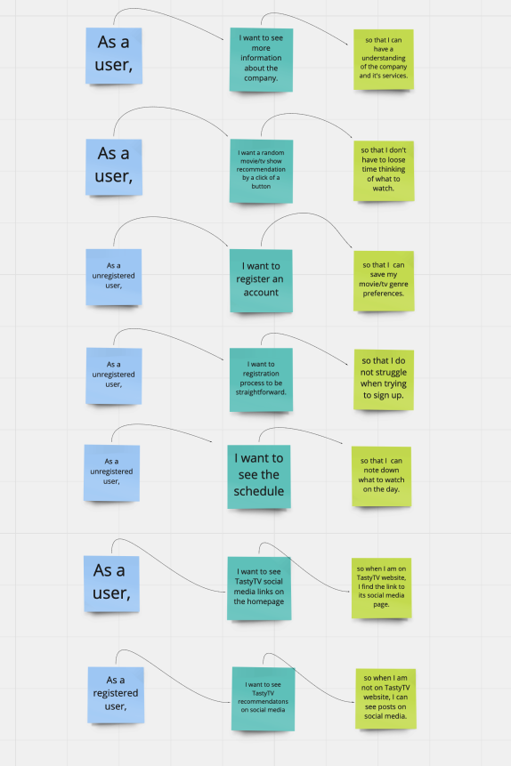
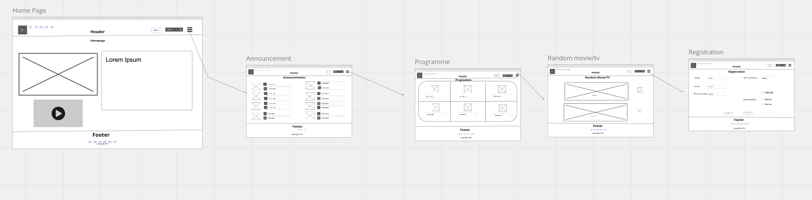
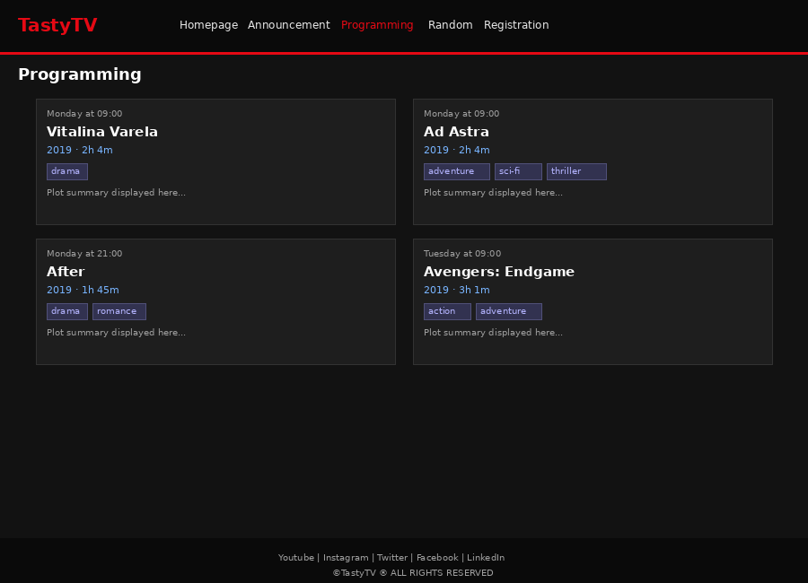
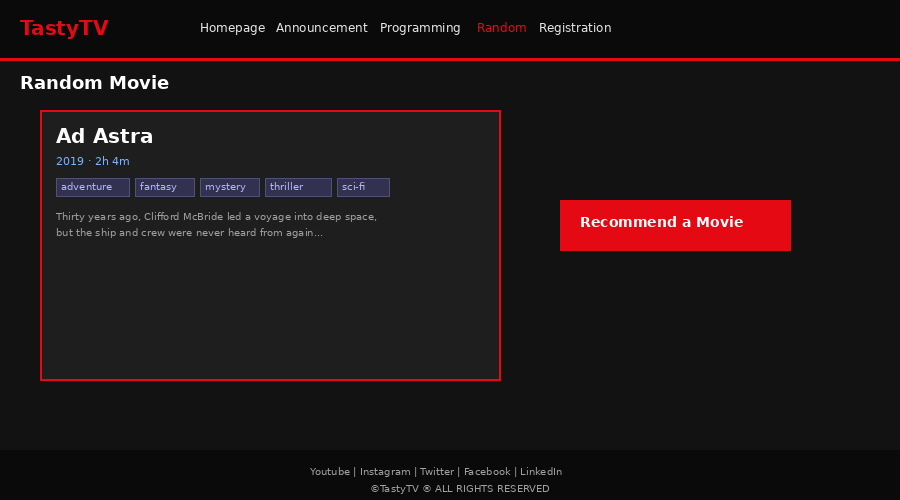
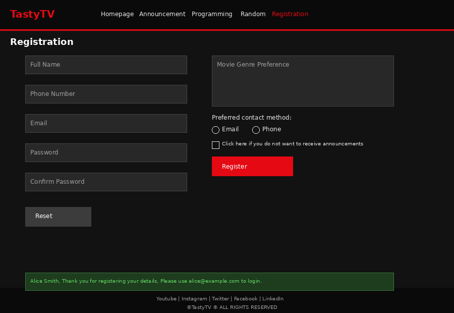

# Project - TastyTV

> TastyTV is a movie and tv show live-streaming service. Client requires a promotional website to publicise the company and its offerings.
> Live demo [_here_](https://jxrtpd.csb.app/).

## Table of Contents

- [General Information](#general-information)
- [Technologies Used](#technologies-used)
- [Features](#features)
- [Screenshots](#screenshots)
- [Setup](#setup)
- [Usage](#usage)
- [Agent Changes](#agent-changes)
- [Testing](#testing)
- [Project Status](#project-status)
- [Problem-Solving Strategy](#problem-solving-strategy)
- [Room for Improvement](#room-for-improvement)
- [Acknowledgements](#acknowledgements)
- [Contact](#contact)

## General Information

### Introduction

Project is to create a site that will help users discover movies and tv shows.
The main aspects it intends to solve when creating the website is to promote the company and its services.

### Project Purpose

Requirements see below:

- Display information about the company and social links (Home page).
- Programme stream schedule twelve hourly (Programme page).
- Regular announcements.
- Special feature which allows people to get a random tasty movie recommendation from the client collection.
- Website links to client's social media accounts on YouTube, Instagram, Twitter, Facebook and LinkedIn.

Wireframes and User Stories:
> [_Miro board_](https://miro.com/welcomeonboard/eEtWTWxKMmhXcjA1bDVPYXpPVEdVYW1ZaFlnUHN1eERJam1IaUQzRXdqS3o2NFZXT2ZjNlpnamd5a1h1WGFBbnwzMDc0NDU3MzYzNTg5OTQ3NDMx?invite_link_id=699842500565).

## Screenshots

### Original Wireframe & User Stories




### Homepage


*Dark cinematic theme with three info cards: Now Streaming, Company Information (with social media links), and Discover & Enjoy.*

### Programme Page Mockup



*Movie cards display the broadcast time, title, year · runtime metadata, genre badges, and plot summary.*

### Random Movie Page Mockup



*Clicking "Recommend a Movie" picks a random film from 50 titles and shows its title, year · runtime, genre badges, and storyline. A flash animation highlights the card on each click.*

### Registration Page Mockup



*Two-column registration form with full validation: all fields required, passwords must match. A personalised success message is shown on valid submission.*

## Technologies Used

- HTML - version: 5.0
- CSS - version: 3.0
- JavaScript - version: ES6
- Jest - version: ^30 (test runner)
- jsdom - version: ^30 (DOM simulation for unit tests)

## Features

### Core Features

- **Social media links** — clicking any social link in the homepage info box or footer opens the platform in a new tab (YouTube, Instagram, Twitter, Facebook, LinkedIn).
- **Programme schedule** — the Programming page dynamically renders 8 movie cards showing the 12-hour repeating broadcast schedule (Mon–Tue, 09:00 and 21:00 slots).
- **Random movie recommendation** — clicking "Recommend a Movie" selects a random film from a pool of 50 titles and displays its details instantly.
- **Registration form** — users can register with their name, email, phone number, and password. A personalised confirmation message is shown on success.
- **Form reset** — the Reset button clears all input fields and removes any displayed messages.
- **Active nav link** — the current page's navigation link is highlighted in red.

### Features Added by Agents

- **Dark cinematic theme** (PR #3) — full-site redesign using a near-black background, red accent colour, off-white body text, and card-based layouts.
- **Movie metadata** (PR #3) — each movie card on the Programme and Random pages shows release year and runtime formatted as `Yh Mm` (e.g. `2019 · 2h 4m`).
- **Genre badges** (PR #3) — coloured pill badges display the genre categories for each movie (e.g. `drama`, `sci-fi`, `action`).
- **Expanded movie pool** (PR #3) — the random.js movie catalogue was expanded to 50 titles, each enriched with year, runtime, director, writer, actor, and category data.
- **Flash animation on recommendation** (PR #3) — the movie card gains a `movie-flash` CSS class on every button click, providing a visual pulse effect.
- **Form validation** (PR #2) — the registration form validates that all required fields are filled and that the two password fields match before accepting a submission.
- **Announcement page** (PR #2) — `announcement.html` was created with placeholder content, fixing the previously broken navigation link.
- **CSS path and argument order fixes** (PR #2) — corrected a CSS `href` path typo and fixed the argument order in `programme.js`'s `addMovie` calls.

## Setup

Where is it located?

> Web link [_here_](https://1jyqr.csb.app/).
> CodeSandbox link [_here_](https://codesandbox.io/s/project-tastytv-sp-1jyqr).

To run locally, clone the repository and open `index.html` in any modern browser. No build step is required.

To run the test suite:

```bash
npm install
npm test
```

## Planning Stage

- With reference to client brief, a wireframe and user story was created.
- I looked at class tutorials, Metacritic, Apple and IMDB for conceptual ideas (streaming sites not promotional).
- Sitemap starts with the Homepage (static) which connects to:
  - Announcement
  - Programme
  - Random movie page
  - Registration

  As well as including the client's initial requirements. The wireframe includes some extras such as the burger menu, sign-in button, and search feature etc.

## Development Stage

### Retrospective

The project went through three agent-driven improvement cycles after the initial build. See [Agent Changes](#agent-changes) for a full breakdown.

## Usage

- Various web browsers such as Chrome, Firefox, Edge etc.
- Different OS e.g. Windows and Mac.
- Different devices for a responsive test.
  Not responsive on all devices e.g. mobiles & tablets.

Usage across pages listed below:

**Homepage:**
- Includes three info cards: Now Streaming, Company Information, and Discover & Enjoy.
- Social media links in the Company Information card open each platform in a new tab.
  `<a href="https://www.youtube.com/" target="_blank">`
- Navigation links in the header allow movement between all pages.
  `<a href="announcement.html">Announcement</a>`

**Announcement:**
- Includes placeholder content and images for future announcements (lorem ipsum).

**Programming:**
- Displays the twelve-hour streaming programme schedule dynamically via `programme.js`.
  Monday 09:00–21:00: one movie repeats; 21:00–09:00 (Tuesday): a different movie repeats.
- Each card shows: broadcast time, title, year · runtime, genre badges, and plot summary.

**Random:**
- Clicking "Recommend a Movie" picks a random film from a 50-title catalogue.
- The selected movie's name, storyline, year · runtime metadata, and genre badges are displayed.
- A flash animation highlights the card on each recommendation.
  See `random.js` for code.

**Registration:**
- Includes text fields (name, phone, email, password, confirm password), a genre preference textarea, radio buttons (preferred contact method), and a checkbox (opt out of announcements).
- Clicking Register validates all required fields; if passwords do not match an error is shown.
- On valid submission a personalised message is displayed: `Alice Smith, Thank you for registering…`
- Clicking Reset clears all fields and removes any displayed message.
  See `registration.js` for code.

## Agent Changes

### PR #2 — Bug Fixes (`copilot/improve-project-structure`)

Multiple bugs that broke core functionality were identified and fixed:

| File | Change |
|---|---|
| `announcement.html` | Created — the file was missing, causing a 404 when clicking the Announcement nav link |
| `random.html` | Fixed CSS `href` path typo (`src/css/random.css` was mis-linked) |
| `registration.html` | Corrected the Reset button `type` and form field IDs to match the JS selectors |
| `src/js/programme.js` | Fixed incorrect argument order in `addMovie(name, time, …)` calls |
| `src/js/registration.js` | Added full form validation (required fields + password match) and reset handler |

### PR #3 — Frontend Overhaul (`copilot/improve-frontend-look-and-feel`)

A complete visual redesign and data enrichment pass across all pages:

- **Global styles** (`src/css/style.css`) — dark background (`#121212`), red accent (`#e5091b`), card shadows, and smooth CSS transitions applied site-wide.
- **Homepage** (`index.html` + `src/css/index.css`) — three-column card layout replacing the original flat text blocks; emoji icons added to section headings.
- **Programme** (`src/js/programme.js` + `src/css/programme.css`) — `addMovie` refactored to `addMovies(array)`; movie objects now carry optional `year`, `runtime`, and `categories` fields; meta line (`year · Xh Ym`) and genre badge pills rendered when data is present.
- **Random** (`src/js/random.js` + `src/css/random.css`) — movie pool expanded from 8 to 50 entries, each with full metadata; `movie-flash` CSS animation added; `.random-meta` and `.random-badges` elements injected into the DOM on each click.
- **Registration** (`src/css/registration.css`) — two-column form layout, styled inputs, red Register button, and a styled success/error message area.
- **Announcement** (`src/css/announcement.css`) — card-style announcement blocks with consistent header and footer styling.

### PR #4 — Regression Test Suite (`copilot/check-regression-tests-impact`)

A full Jest + jsdom test suite was added to guard against regressions in all JavaScript modules:

| Test file | Scope |
|---|---|
| `tests/formatRuntime.test.js` | Unit tests for the `formatRuntime` utility (hours+minutes, minutes-only, zero/negative, non-numeric inputs, numeric strings) |
| `tests/programme.test.js` | DOM rendering tests — card count, time/title/storyline elements, optional meta and genre badges, `addMovies` re-render behaviour |
| `tests/random.test.js` | Button-click tests — name/storyline population, `.random-meta` and `.random-badges` creation, flash class, badge refresh on repeat clicks |
| `tests/registration.test.js` | Form validation tests — empty fields, individual missing fields, password mismatch, success message template, whitespace trimming, and form reset |

## Testing

The project uses **Jest** with **jest-environment-jsdom** for unit and DOM integration tests.

### Running Tests

```bash
npm install
npm test
```

### Test Results

```
PASS tests/formatRuntime.test.js
PASS tests/programme.test.js
PASS tests/random.test.js
PASS tests/registration.test.js

Test Suites: 4 passed, 4 total
Tests:       40 passed, 40 total
```

### Test Coverage Summary

**`formatRuntime` (6 tests)**
- Converts hours and minutes correctly (e.g. 124 min → `2h 4m`)
- Handles minutes-only runtimes (e.g. 45 min → `45m`)
- Returns empty string for zero or negative values
- Returns empty string for non-numeric input (`NaN`, `undefined`, `null`, `"abc"`, `""`)
- Parses numeric strings correctly (e.g. `"124"` → `"2h 4m"`)

**`programme.js` DOM rendering (13 tests)**
- Renders the expected 8 movie cards on load
- Each card contains `movie-time`, `movie-title`, and `movie-storyline` elements
- Cards without year/runtime do not render a `movie-meta` element
- `addMovies` renders a `movie-meta` element (`year · runtime`) when data is supplied
- Meta element uses `·` as separator when both year and runtime are present
- Cards without categories do not render `genre-badges`
- `addMovies` renders `genre-badges` with individual `.badge` spans when categories are supplied
- Known movies `Vitalina Varela` and `Avengers: Endgame` appear in the programme
- `addMovies` clears existing content before re-rendering
- `addMovies` handles minimal movie objects (no meta, no badges)

**`random.js` movie recommendation (10 tests)**
- Clicking the button populates the movie name and storyline
- Clicking creates a `.random-meta` element that is non-empty and contains a 4-digit year
- Clicking creates a `.random-badges` element with at least one `.random-badge` span
- Clicking multiple times updates the displayed information (variety check over 30 clicks)
- `movie-flash` class is added to the card on each click
- Badges are cleared and re-populated on each click (no accumulation)
- Movies array contains at least 10 entries

**`registration.js` form validation (11 tests)**
- Shows error when all fields are empty
- Shows error when any individual required field (name, email, phone, password, confirm password) is missing
- Shows error when passwords do not match
- Shows personalised success message containing the user's name and email
- Success message uses the exact expected template string
- Whitespace-only field values are treated as empty (trimming)
- Resetting the form clears the message element

## Project Status

Project is: _Complete_

## Problem-Solving Strategy

- Break down client brief into smaller sections to work on each day.
- Reread the client brief, wireframe and user stories.
- Look at resources — what is available and what is required.
- Debugging options:
  - W3C HTML and CSS validator when created or made changes to files.
  - `console.log` to check results when implementing code or debugging.
  - Use debugger for functions, looking through scope tab and comparing with tutorial.
  - Read through code block by block.
  - Check where sections of code are related to each other.
  - Rewrote blocks of code from scratch to aid debugging.
- Get parts of the site and code checked by someone else for a fresh perspective.
- Use an automated test suite (Jest) to prevent regressions after each change.

## Room for Improvement

Room for improvement:

- Programming page needs to be edited to make it more readable on smaller screens.
- Registration — password strength indicator would improve UX.
- Upload more content, style and interactive elements.
- Orientation of some of the images/video could be adjusted.
- Get the images to enlarge when user hovers over them.
- Nav links could go in a burger menu as the header could be better.
- Could be improved by reducing the number of pages i.e. putting some content into sections on the same page.

To do:

- Create a responsive website and possible app for user-friendly, quicker access.
- Burger menu as an extra feature including social media links.
- Hover effects: text changes colour or size.
- Implement social media icons instead of text links.
- Random movie page to automatically give suggestions without clicking the button.
- Sign-in form to open in a modal/new window.
- Movie ratings and reviews on the Programme and Recommendation pages.
- Registration process to show inline suggestions if details are incorrect.

## Acknowledgements

- This project was inspired by class tutorials, Metacritic, Apple and IMDB.
- This project was based on [this tutorial](https://www.example.com).
- [Metacritic](https://www.metacritic.com/).
- [IMDB](https://www.imdb.com/).
- [Apple](https://www.apple.com/uk/).
- [README](https://github.com/ritaly/README-cheatsheet).
- [Flexbox & Grid](https://mugx7.csb.app/).
- [Flexbox & Grid practice](https://3ojfd.csb.app/).
- [CSS grid](https://1egol.csb.app/).
- [prework](https://c7nnn.csb.app/).
- [prework test](https://sqeoc.csb.app/).
- [Objects & callbacks](https://lpgkn.csb.app/)
- [Random](https://stackoverflow.com/questions/4550505/getting-a-random-value-from-a-javascript-array)
- [Javascript first steps](https://nsd4c.csb.app/index.js)
- [DOM Rainbow Loops](https://g5nbf.csb.app/)
- [Practice Exercise 2](https://t9y4s.csb.app/#page-home)
- [Assignment Arrays](https://hpd72.csb.app/)
- [Freecodecamp Loops](https://www.freecodecamp.org/news/javascript-array-of-objects-tutorial-how-to-create-update-and-loop-through-objects-using-js-array-methods/)
- [MDN](https://developer.mozilla.org/en-US/docs/Web/JavaScript/Reference/Global_Objects/Array/forEach).
- [DOM manipulation study](https://mpqcw.csb.app/)
- [CSS tricks](https://css-tricks.com/snippets/css/a-guide-to-flexbox/#flexbox-properties)
- [CSS tricks](https://css-tricks.com/snippets/css/complete-guide-grid/)
- [W3schools - onreset](https://www.w3schools.com/jsref/tryit.asp?filename=tryjsref_onreset3).
- [W3schools](https://www.w3schools.com/).
- [MDN](https://developer.mozilla.org/en-US/).

## Contact

Created by [Stanton] - If any questions, feel free to contact me.
