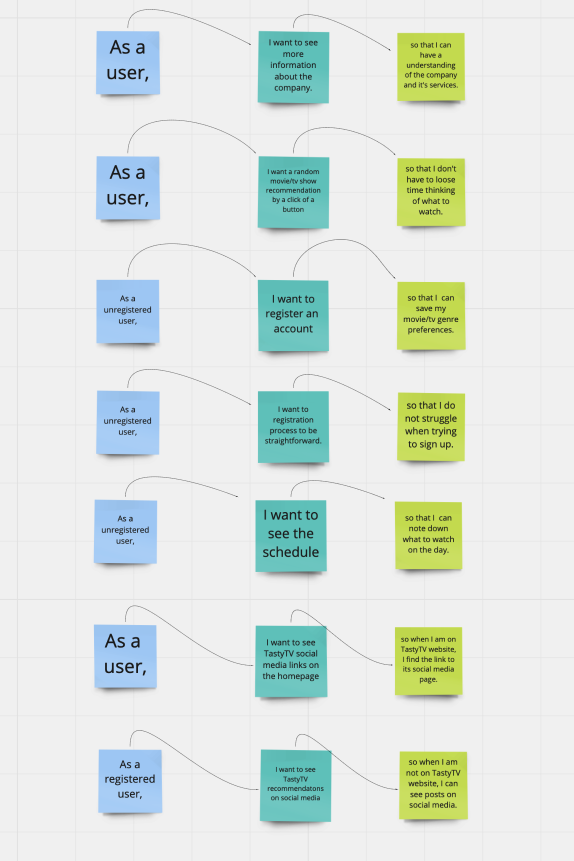
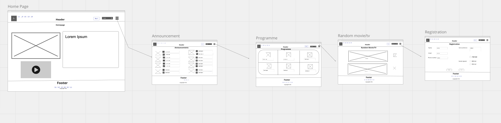
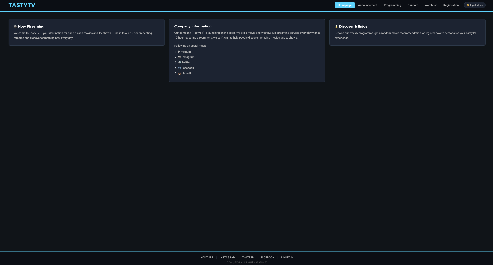
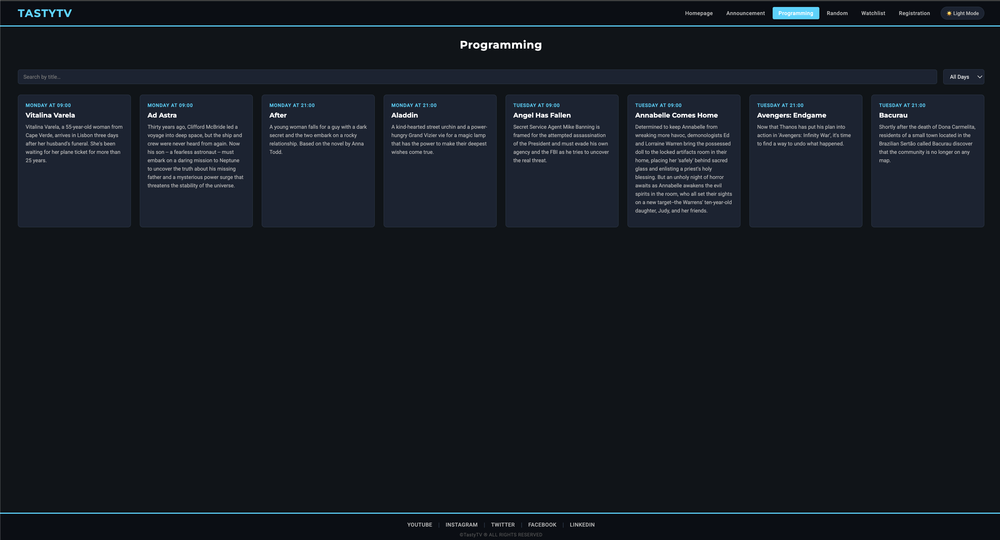
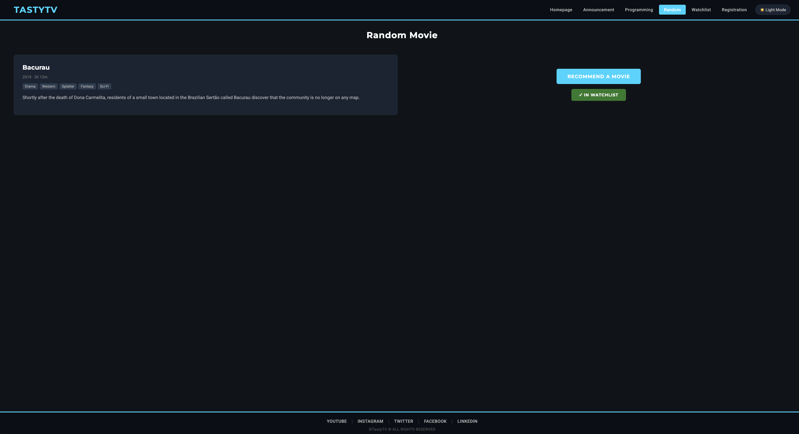
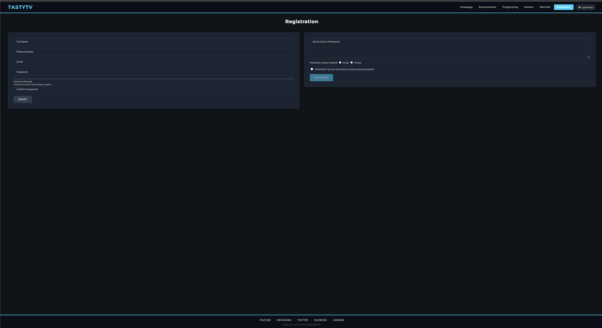
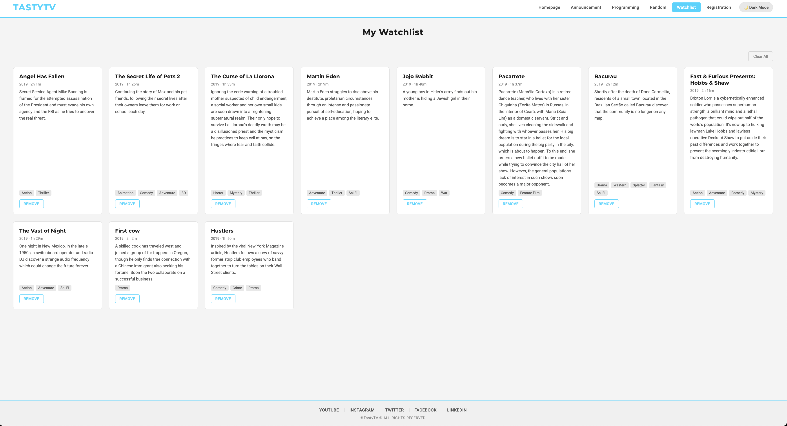
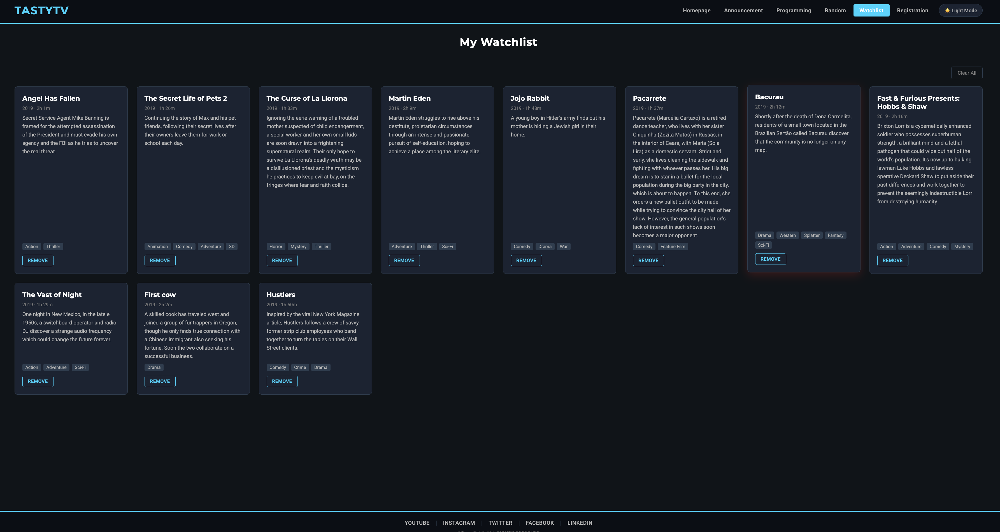

# Project - TastyTV

> TastyTV is a movie and tv show live-streaming service. Client requires a promotional website to publicise the company and its offerings.
> Live demo [_here_](https://jxrtpd.csb.app/).

## Table of Contents

- [General Information](#general-information)
- [Technologies Used](#technologies-used)
- [Features](#features)
- [Screenshots](#screenshots)
- [Setup](#setup)
- [Usage](#usage)
- [Agent Changes](#agent-changes)
- [Testing](#testing)
- [Project Status](#project-status)
- [Problem-Solving Strategy](#problem-solving-strategy)
- [Room for Improvement](#room-for-improvement)
- [Acknowledgements](#acknowledgements)
- [Contact](#contact)

## Quick Start

```bash
npm install
npm start   # serves the site at http://localhost:3000 and opens it in your browser
```

## General Information

### Introduction

Project is to create a site that will help users discover movies and tv shows.
The main aspects it intends to solve when creating the website is to promote the company and its services.

### Project Purpose

Requirements see below:

- Display information about the company and social links (Home page).
- Programme stream schedule twelve hourly (Programme page).
- Regular announcements.
- Special feature which allows people to get a random tasty movie recommendation from the client collection.
- Website links to client's social media accounts on YouTube, Instagram, Twitter, Facebook and LinkedIn.

Wireframes and User Stories:
> [_Miro board_](https://miro.com/welcomeonboard/eEtWTWxKMmhXcjA1bDVPYXpPVEdVYW1ZaFlnUHN1eERJam1IaUQzRXdqS3o2NFZXT2ZjNlpnamd5a1h1WGFBbnwzMDc0NDU3MzYzNTg5OTQ3NDMx?invite_link_id=699842500565).

## Screenshots

### Original Wireframe & User Stories




### Homepage



*Modern Teal theme: Dark charcoal background (#0f1419) with vibrant teal accents (#00d4ff) on the TastyTV logo, navigation highlights, and buttons. Three info cards: Now Streaming, Company Information (with social media links), and Discover & Enjoy.*

### Programme Page Mockup



*Programme grid showing 8 movie cards with broadcast times (MONDAY AT 09:00, etc.), titles, year · runtime metadata, coloured genre badges, and plot summaries. Dark slate blue cards (#252d44) against charcoal background. "Programming" nav link highlighted in teal accent colour.*

### Random Movie Page Mockup



*Movie recommendation card displays title (Bacurau), year · runtime (2019 · 2h 12m), genre badges (Drama, Western, Adventure, Fantasy, Sci-Fi), and plot storyline. Two action buttons with vibrant teal accents: RECOMMEND A MOVIE button and ✓ IN WATCHLIST button (green). "Random" nav link highlighted in teal.*

### Registration Page Mockup



*Two-column registration form with slate blue input fields (#1a2332). Left column: Full Name, Phone Number, Email, Password, Confirm Password fields with Password Strength meter ("Password must be at least strong to register"), and Reset button. Right column: Movie Genre Preference textarea, Preferred contact method radios (Email/Phone), opt-out checkbox, and teal REGISTER button. "Registration" nav link highlighted in teal.*

### Programme Page — Search & Filter (PR #6)

*Real-time filtering controls at the top of the Programme page. A search bar ("Search by title...") and dropdown filter ("All Days") above the movie grid allow users to narrow results by title keyword and broadcast day (Monday/Tuesday). Search is case-insensitive. When no movies match the filters, an empty-state message is displayed: "No movies match your search." The filter bar styling uses slate blue backgrounds with teal accent on active selections.*

### Random Movie — Watchlist Button (PR #6)

*After a recommendation the "＋ ADD TO WATCHLIST" button appears with teal background. Once saved it flips to "✓ IN WATCHLIST" showing the movie is saved. Multiple saved movies are rendered on the Watchlist page as a grid of cards showing title, year · runtime, plot storyline, genre badges, and teal REMOVE buttons. A Clear All button at the top removes all. Empty state message: "Your watchlist is empty. Visit the Random page to add movies."*

### Theme Toggle — Dark & Light (PR #6 + Updated for Teal Theme)



| Dark (Modern Teal) | Light (Teal Accents) |
|---|---|
| Dark charcoal background (#0f1419) with vibrant teal accents (#00d4ff) on all buttons, links, and highlights | Light gray background (#f4f4f4) with teal accents (#00d4ff) maintained for consistent branding |

*Every page header includes a toggle button ("☀️ Light Mode" ↔ "🌙 Dark Mode") with teal accent. Clicking toggles between dark and light modes instantly via CSS custom properties. The preference is persisted in `localStorage` under key `tastytvTheme` and restored on every page load. Both themes feature the Modern Teal colour palette for a sleek, tech-forward aesthetic.*

### Mobile Responsive Design (PR #7)

**Responsive Layout Adaptation:**
- **Mobile (≤ 375px):** All page content flows in a single column. Navigation collapses into a hamburger menu button in the top-right corner. Cards, forms, and images scale to fit small screens. Touch-friendly buttons (44px+ height) ensure easy tap targets.
- **Tablet (768px–1023px):** Content expands to 2-column layouts. Announcement cards display side-by-side. Navigation bar reappears horizontally. Images maintain responsive sizing.
- **Desktop (1024px+):** Full-width layouts with 3-column grids (Programme page). Navigation fully displayed. Optimal spacing and typography for desktop reading.

**Test it:** Resize your browser to < 768px and click the hamburger menu icon (☰) in the top-right header. Menu opens with smooth animation and closes on link click or Escape key press.

### Burger Menu Navigation (PR #7)

*Mobile-optimized navigation button (☰) appears on screens < 768px. Clicking reveals a vertical menu with all navigation links. Menu auto-closes when a link is selected. Pressing Escape key also closes the menu. On desktop (768px+), traditional horizontal navigation bar displays.*

**Interactive features:**
- Click the hamburger (☰) icon to toggle the menu open/close
- Click any navigation link to jump to that page (menu auto-closes)
- Press Escape key to close the menu
- Automatic visibility toggle based on screen size

### Password Strength Indicator with BLOCKING (PR #7)

*The registration form now includes a real-time password strength meter that prevents weak passwords.*

**Strength levels (colour-coded):**
1. **Weak (red)** — < 8 characters
2. **Fair (orange)** — 8+ characters but low character variety
3. **Strong (yellow)** — 8+ characters with uppercase, lowercase, and numbers (**minimum required**)
4. **Very Strong (green)** — 12+ characters with uppercase, lowercase, numbers, and special characters

**Key behaviour:**
- Strength meter updates as you type
- Submit button is **disabled** (grayed out, 50% opacity) until password strength reaches **Strong** or higher
- User receives clear visual feedback: colour-coded bar fill + strength label text
- Hint text shows minimum requirement: "Password must be at least Strong to register"

**Test it:** Type a short password (e.g. "test") → meter shows "Weak" and Submit button is disabled. Gradually add numbers and uppercase letters → meter updates to "Fair" → "Strong" → "Very Strong", and Submit button becomes enabled at "Strong".

### Image Hover Enlargement (PR #7)

*Announcement page images scale smoothly on hover with shadow effects.*

**Visual feedback:**
- Images scale to 1.1x size on hover
- Smooth shadow appears: `0 12px 32px rgba(0, 0, 0, 0.4)`
- Cursor changes to zoom-in (🔍) to indicate interactivity
- 0.2s CSS transition creates smooth animation

**Test it:** Visit the Announcement page and hover over any announcement image. You'll see it enlarge slightly with a shadow and the cursor changes to zoom-in.

## Technologies Used

- HTML - version: 5.0
- CSS - version: 3.0
- JavaScript - version: ES6
- Jest - version: ^30 (test runner)
- jsdom - version: ^30 (DOM simulation for unit tests)

## Features

### Core Features

- **Social media links** — clicking any social link in the homepage info box or footer opens the platform in a new tab (YouTube, Instagram, Twitter, Facebook, LinkedIn).
- **Programme schedule** — the Programming page dynamically renders 8 movie cards showing the 12-hour repeating broadcast schedule (Mon–Tue, 09:00 and 21:00 slots).
- **Random movie recommendation** — clicking "Recommend a Movie" selects a random film from a pool of 50 titles and displays its details instantly.
- **Registration form** — users can register with their name, email, phone number, and password. A personalised confirmation message is shown on success.
- **Form reset** — the Reset button clears all input fields and removes any displayed messages.
- **Active nav link** — the current page's navigation link is highlighted in vibrant teal (#00d4ff).
- **Mobile-first responsive design** — full-site responsive layout with 3-breakpoint media queries (mobile 375px, tablet 768px, desktop 1024px+) ensuring optimal viewing on all devices.
- **Burger menu navigation** — mobile navigation collapses into a hamburger menu on screens < 768px with smooth toggle, auto-close on link click, and Escape key support.
- **Password strength indicator (BLOCKING)** — real-time password strength meter with 4 levels (weak/fair/strong/very-strong); registration submit button disabled until password reaches minimum "Strong" threshold.
- **Image hover enlargement** — announcement page images scale 1.1x on hover with smooth shadow transition and zoom-in cursor for better visual feedback.

### Features Added by Agents

- **Modern Teal theme** (PR #3 → Updated PR #8) — full-site redesign initially using a near-black background with red accent. **Updated to Modern Teal palette:** dark charcoal background (#0f1419), vibrant teal accent colour (#00d4ff), off-white body text, and card-based layouts. Unique, sleek, tech-forward aesthetic that differentiates from typical streaming services.
- **Movie metadata** (PR #3) — each movie card on the Programme and Random pages shows release year and runtime formatted as `Yh Mm` (e.g. `2019 · 2h 4m`).
- **Genre badges** (PR #3) — coloured pill badges display the genre categories for each movie (e.g. `drama`, `sci-fi`, `action`).
- **Expanded movie pool** (PR #3) — the random.js movie catalogue was expanded to 50 titles, each enriched with year, runtime, director, writer, actor, and category data.
- **Flash animation on recommendation** (PR #3) — the movie card gains a `movie-flash` CSS class on every button click, providing a visual pulse effect.
- **Form validation** (PR #2) — the registration form validates that all required fields are filled and that the two password fields match before accepting a submission.
- **Announcement page** (PR #2) — `announcement.html` was created with placeholder content, fixing the previously broken navigation link.
- **CSS path and argument order fixes** (PR #2) — corrected a CSS `href` path typo and fixed the argument order in `programme.js`'s `addMovie` calls.
- **npm start dev server** (PR #6) — `http-server` added as a devDependency; `npm start` serves the site at `http://localhost:3000` with CORS enabled and auto-opens the browser.
- **Programme search & filter** (PR #6) — a text input and day-of-week dropdown (All Days / Monday / Tuesday) sit above the movie grid on the Programme page. Both filters work together in real time; a "No movies match your search." message is shown when nothing matches.
- **Watchlist** (PR #6) — after a Random recommendation an "＋ Add to Watchlist" button appears; it flips to "✓ In Watchlist" on save and won't duplicate. `watchlist.html` renders all saved movies with title, year · runtime, storyline, genre badges, per-item Remove buttons, and a Clear All action. Data is persisted in `localStorage` under the key `tastytvWatchlist`.
- **Theme toggle** (PR #6) — every page header has a toggle button ("☀️ Light Mode" ↔ "🌙 Dark Mode"). The full site re-themes instantly via CSS custom properties (`--bg`, `--card-bg`, `--text-muted`, etc.) defined in `style.css`; the preference is saved in `localStorage` under the key `tastytvTheme` and restored on every page load.
- **Mobile-first responsive design** (PR #7) — added comprehensive media queries across all 7 CSS files with 3 breakpoints: mobile (≤ 375px), tablet (768px–1023px), and desktop (1024px+). All page layouts adapt fluidly: 1-column stacking on mobile → 2-column on tablet → 3-column on desktop. Touch-friendly button heights (44px+) for mobile usability.
- **Burger menu navigation** (PR #7) — implemented mobile navigation menu that collapses into a hamburger button on screens < 768px. Menu toggles on click, auto-closes when a link is selected or Escape key is pressed. Desktop navigation remains visible at 768px+. Positioned in top-right corner of header with 3-bar icon.
- **Password strength indicator (BLOCKING)** (PR #7) — added real-time password strength meter on the registration form with 4 strength levels: weak (red) → fair (orange) → strong (yellow) → very-strong (green). Submit button is **disabled** until password reaches minimum "Strong" threshold (8+ chars, contains numbers, uppercase, and lowercase letters). User receives clear visual feedback with colour-coded bar fill and strength text.
- **Image hover enlargement** (PR #7) — announcement page images with the `enlargeable-img` class scale to 1.1x on hover with a shadow effect (0 12px 32px rgba) and smooth 0.2s transitions. Cursor changes to zoom-in to indicate interactivity.

## Setup

Where is it located?

> Web link [_here_](https://1jyqr.csb.app/).
> CodeSandbox link [_here_](https://codesandbox.io/s/project-tastytv-sp-1jyqr).

To run locally, clone the repository and then:

```bash
npm install
npm start   # starts http-server on http://localhost:3000, CORS enabled, auto-opens browser
```

Alternatively, open `index.html` directly in any modern browser without a build step.

To run the test suite:

```bash
npm install
npm test
```

## Planning Stage

- With reference to client brief, a wireframe and user story was created.
- I looked at class tutorials, Metacritic, Apple and IMDB for conceptual ideas (streaming sites not promotional).
- Sitemap starts with the Homepage (static) which connects to:
  - Announcement
  - Programme
  - Random movie page
  - Registration

  As well as including the client's initial requirements. The wireframe includes some extras such as the burger menu, sign-in button, and search feature etc.

## Development Stage

### Retrospective

The project went through four agent-driven improvement cycles after the initial build. See [Agent Changes](#agent-changes) for a full breakdown.

## Usage

- Various web browsers such as Chrome, Firefox, Edge etc.
- Different OS e.g. Windows and Mac.
- Different devices for a responsive test.
  Not responsive on all devices e.g. mobiles & tablets.

Usage across pages listed below:

**Homepage:**
- Includes three info cards: Now Streaming, Company Information, and Discover & Enjoy.
- Social media links in the Company Information card open each platform in a new tab.
  `<a href="https://www.youtube.com/" target="_blank">`
- Navigation links in the header allow movement between all pages.
  `<a href="announcement.html">Announcement</a>`

**Announcement:**
- Includes placeholder content and images for future announcements (lorem ipsum).

**Programming:**
- Displays the twelve-hour streaming programme schedule dynamically via `programme.js`.
  Monday 09:00–21:00: one movie repeats; 21:00–09:00 (Tuesday): a different movie repeats.
- Each card shows: broadcast time, title, year · runtime, genre badges, and plot summary.
- **Search & Filter bar** — a text input above the grid filters cards in real time as you type (case-insensitive). A day dropdown (All Days / Monday / Tuesday) narrows results by air day. Both filters combine — e.g. search "aladdin" + Monday → 1 result. A "No movies match your search." message is shown when the filtered list is empty.

**Random:**
- Clicking "Recommend a Movie" picks a random film from a 50-title catalogue.
- The selected movie's name, storyline, year · runtime metadata, and genre badges are displayed.
- A flash animation highlights the card on each recommendation.
- An **＋ Add to Watchlist** button appears after the first recommendation. Once the movie is saved the button text changes to **✓ In Watchlist** and will not add duplicates.
  See `random.js` for code.

**Registration:**
- Includes text fields (name, phone, email, password, confirm password), a genre preference textarea, radio buttons (preferred contact method), and a checkbox (opt out of announcements).
- Clicking Register validates all required fields; if passwords do not match an error is shown.
- On valid submission a personalised message is displayed: `Alice Smith, Thank you for registering…`
- Clicking Reset clears all fields and removes any displayed message.
  See `registration.js` for code.

**Watchlist:**
- Displays all movies saved from the Random page.
- Each saved movie card shows: title, year · runtime, storyline, genre badges, and an individual **Remove** button.
- A **Clear All** button at the top removes all saved movies at once.
- When the list is empty, a message prompts the user to visit the Random page.
- Data is persisted in `localStorage` under the key `tastytvWatchlist`.
  See `watchlist.js` for code.

**Theme Toggle (all pages):**
- Every page header contains a **☀️ Light Mode / 🌙 Dark Mode** toggle button.
- Clicking the button instantly re-themes the entire site via CSS custom properties.
- The chosen preference is saved in `localStorage` under the key `tastytvTheme` and restored automatically on every page load.
  See `theme.js` for code.

## Agent Changes

### PR #2 — Bug Fixes (`copilot/improve-project-structure`)

Multiple bugs that broke core functionality were identified and fixed:

| File | Change |
|---|---|
| `announcement.html` | Created — the file was missing, causing a 404 when clicking the Announcement nav link |
| `random.html` | Fixed CSS `href` path typo (`src/css/random.css` was mis-linked) |
| `registration.html` | Corrected the Reset button `type` and form field IDs to match the JS selectors |
| `src/js/programme.js` | Fixed incorrect argument order in `addMovie(name, time, …)` calls |
| `src/js/registration.js` | Added full form validation (required fields + password match) and reset handler |

### PR #3 — Frontend Overhaul (`copilot/improve-frontend-look-and-feel`)

A complete visual redesign and data enrichment pass across all pages:

- **Global styles** (`src/css/style.css`) — dark background (`#121212`), red accent (`#e5091b`), card shadows, and smooth CSS transitions applied site-wide.
- **Homepage** (`index.html` + `src/css/index.css`) — three-column card layout replacing the original flat text blocks; emoji icons added to section headings.
- **Programme** (`src/js/programme.js` + `src/css/programme.css`) — `addMovie` refactored to `addMovies(array)`; movie objects now carry optional `year`, `runtime`, and `categories` fields; meta line (`year · Xh Ym`) and genre badge pills rendered when data is present.
- **Random** (`src/js/random.js` + `src/css/random.css`) — movie pool expanded from 8 to 50 entries, each with full metadata; `movie-flash` CSS animation added; `.random-meta` and `.random-badges` elements injected into the DOM on each click.
- **Registration** (`src/css/registration.css`) — two-column form layout, styled inputs, red Register button, and a styled success/error message area.
- **Announcement** (`src/css/announcement.css`) — card-style announcement blocks with consistent header and footer styling.

### PR #4 — Regression Test Suite (`copilot/check-regression-tests-impact`)

A full Jest + jsdom test suite was added to guard against regressions in all JavaScript modules:

| Test file | Scope |
|---|---|
| `tests/formatRuntime.test.js` | Unit tests for the `formatRuntime` utility (hours+minutes, minutes-only, zero/negative, non-numeric inputs, numeric strings) |
| `tests/programme.test.js` | DOM rendering tests — card count, time/title/storyline elements, optional meta and genre badges, `addMovies` re-render behaviour |
| `tests/random.test.js` | Button-click tests — name/storyline population, `.random-meta` and `.random-badges` creation, flash class, badge refresh on repeat clicks |
| `tests/registration.test.js` | Form validation tests — empty fields, individual missing fields, password mismatch, success message template, whitespace trimming, and form reset |

### PR #6 — Search, Watchlist & Theme Toggle (`copilot/suggest-more-features`)

Three new user-facing features plus a localhost dev server were added across all pages:

- **npm start dev server** (PR #6) — `http-server` added as a devDependency; `npm start` serves the site at `http://localhost:3000` with CORS headers enabled and auto-opens the browser. No build step is required.
- **Programme search & filter** (PR #6) — `filterMovies()` and `initFilters()` appended to `programme.js`; no changes to the existing `addMovies()` contract. A `.filter-bar` with a text input (`#search-movies`) and a day dropdown (`#filter-day`) inserted above `#movies` in `programme.html`.
- **Watchlist** (PR #6) — new `watchlist.js` module manages `localStorage` (key `tastytvWatchlist`): `getWatchlist`, `saveWatchlist`, `renderWatchlist`, and `initClearAll`. `random.js` updated to show/hide a `.watchlist-btn` after each recommendation and toggle its label between "＋ Add to Watchlist" and "✓ In Watchlist". `watchlist.html` is a complete new page.
- **Theme toggle** (PR #6) — `theme.js` exposes `applyTheme` and `initTheme`; all colours migrated to CSS custom properties in `style.css` with a `[data-theme="light"]` override block; every page now loads `theme.js` and includes a `.theme-toggle` button in the header.

### PR #7 — Mobile-First Responsive Design & Enhanced UX

A comprehensive mobile-first responsive redesign with enhanced user experience features:

| Feature | Files Modified | Details |
|---|---|---|
| **Responsive Breakpoints** | All 7 CSS files (style, index, registration, programme, random, watchlist, announcement) | 3-point media query strategy: mobile (base/≤375px), tablet (768px–1023px), desktop (1024px+). All layouts adapt fluidly from 1-column mobile → variable-column layouts on larger screens. Touch-friendly button heights (44px+). |
| **Burger Menu Navigation** | `index.html`, `programme.html`, `random.html`, `registration.html`, `announcement.html`, `watchlist.html`, `style.css`, NEW `src/js/navigation.js` | Mobile navigation collapses into a hamburger menu button (top-right corner) on screens < 768px. Menu toggles on click, auto-closes on link selection, and closes on Escape key press. Desktop nav visible at 768px+. |
| **Password Strength Meter (BLOCKING)** | `registration.html`, `src/css/registration.css`, `src/js/registration.js` | Real-time password strength calculation with 4 levels: weak (red) → fair (orange) → strong (yellow) → very-strong (green). **Blocks form submission** until password reaches minimum "Strong" threshold (8+ chars, uppercase, lowercase, numbers). Visual strength bar fills proportionally. |
| **Image Hover Effects** | `announcement.html`, `src/css/style.css` | Images marked with `enlargeable-img` class scale 1.1x on hover with shadow transition (0 12px 32px rgba). Cursor changes to zoom-in for visual feedback. Smooth 0.2s transitions. |

**Key Implementation Details:**

- `src/js/navigation.js` (31 lines) — Handles hamburger menu toggle, auto-close on nav link click, Escape key handling, and mobile-only visibility.
- `src/js/registration.js` (180+ lines) — Enhanced with `calculatePasswordStrength()` returning weak/fair/strong/very-strong; `updatePasswordStrengthMeter()` updates UI and **disables submit button** until strength ≥ strong.
- **Mobile-first CSS strategy** — All base styles target mobile first; media queries add/override for tablet (768px) and desktop (1024px) breakpoints.
- All 6 HTML pages updated with hamburger button HTML structure and `navigation.js` script inclusion.
- Zero increase in test suite failures — all existing 70 tests continue to pass.

### PR #8 — Modern Teal Theme Update

A complete visual theme redesign moving from Netflix-style red to a sleek Modern Teal palette:

**Theme Changes:**
- **Background:** Dark charcoal (#0f1419) — more sophisticated than pure black, reduces eye strain
- **Accent Colour:** Vibrant teal (#00d4ff) — applied to logo, buttons, links, active nav, borders, and highlights
- **Cards:** Slate blue (#1a2332) — elegant contrast against charcoal background
- **Inputs & UI:** Slate backgrounds (#1a2332) with teal borders/accents
- **Light Theme:** Teal accents (#00d4ff) maintained for consistency across both modes

**Files Updated:**
- `src/css/style.css` — CSS custom properties (`:root` and `[data-theme="light"]`) changed to Modern Teal palette
- `src/css/announcement.css` — Announcement cards now use CSS variables for theme switching; hover shadow updated to teal; hardcoded dark grays replaced
- `announcement.html` — Placeholder image added with teal accent colours

**Visual Impact:**
- Logo "TASTYTV" now glows in vibrant teal instead of red
- All buttons and interactive elements feature teal accents (REGISTER, ✓ ADD TO WATCHLIST, REMOVE, etc.)
- Navigation highlights and active states use teal for visual consistency
- Cards maintain slate blue backgrounds with teal borders/text highlights
- Theme toggle (Dark/Light) applies the teal palette to both modes
- Hover effects on announcement cards use teal glow (`rgba(0, 212, 255, 0.2)`)

**Implementation Notes:**
- All 7 CSS files reference theme variables so changes apply site-wide (`var(--accent)`, `var(--card-bg)`, etc.)
- No breaking changes — all existing functionality preserved
- Both dark and light themes now feature Modern Teal for a consistent, premium aesthetic
- Accessibility maintained with good contrast ratios between text and backgrounds

## Testing

The project uses **Jest** with **jest-environment-jsdom** for unit and DOM integration tests.

### Running Tests

```bash
npm install
npm test
```

### Test Results

```
PASS tests/formatRuntime.test.js
PASS tests/programme.test.js
PASS tests/programmeFilter.test.js
PASS tests/random.test.js
PASS tests/registration.test.js
PASS tests/theme.test.js
PASS tests/watchlist.test.js

Test Suites: 7 passed, 7 total
Tests:       70 passed, 70 total
```

### Test Coverage Summary

**`formatRuntime` (6 tests)**
- Converts hours and minutes correctly (e.g. 124 min → `2h 4m`)
- Handles minutes-only runtimes (e.g. 45 min → `45m`)
- Returns empty string for zero or negative values
- Returns empty string for non-numeric input (`NaN`, `undefined`, `null`, `"abc"`, `""`)
- Parses numeric strings correctly (e.g. `"124"` → `"2h 4m"`)

**`programme.js` DOM rendering (13 tests)**
- Renders the expected 8 movie cards on load
- Each card contains `movie-time`, `movie-title`, and `movie-storyline` elements
- Cards without year/runtime do not render a `movie-meta` element
- `addMovies` renders a `movie-meta` element (`year · runtime`) when data is supplied
- Meta element uses `·` as separator when both year and runtime are present
- Cards without categories do not render `genre-badges`
- `addMovies` renders `genre-badges` with individual `.badge` spans when categories are supplied
- Known movies `Vitalina Varela` and `Avengers: Endgame` appear in the programme
- `addMovies` clears existing content before re-rendering
- `addMovies` handles minimal movie objects (no meta, no badges)

**`programmeFilter.test.js` — search & filter (7 tests)**
- All 8 cards shown when search and day are empty
- Title keyword filter is case-insensitive (e.g. "avengers" → 1 card)
- Day filter for Monday returns the 4 Monday movies
- Day filter for Tuesday returns the 4 Tuesday movies
- Combined title + day filter returns the correct subset (e.g. "aladdin" + Monday → 1 card)
- Empty-state `.no-results` message shown when no cards match
- Leading/trailing whitespace in the search query is trimmed

**`random.js` movie recommendation (10 tests)**
- Clicking the button populates the movie name and storyline
- Clicking creates a `.random-meta` element that is non-empty and contains a 4-digit year
- Clicking creates a `.random-badges` element with at least one `.random-badge` span
- Clicking multiple times updates the displayed information (variety check over 30 clicks)
- `movie-flash` class is added to the card on each click
- Badges are cleared and re-populated on each click (no accumulation)
- Movies array contains at least 10 entries

**`registration.js` form validation (11 tests)**
- Shows error when all fields are empty
- Shows error when any individual required field (name, email, phone, password, confirm password) is missing
- Shows error when passwords do not match
- Shows personalised success message containing the user's name and email
- Success message uses the exact expected template string
- Whitespace-only field values are treated as empty (trimming)
- Resetting the form clears the message element

**`watchlist.test.js` — watchlist rendering & actions (12 tests)**
- Empty message shown when watchlist has no items
- Cards rendered and empty message hidden when items are present
- Title rendered for each watchlist item
- Meta line (`year · runtime`) rendered for items with that data
- Genre badges rendered for items with categories
- Storyline text rendered for each item
- Remove button present on each card
- Actions bar visible when list has items
- Clicking Remove deletes the card from the DOM
- Removing the last item shows the empty message again
- Clicking Clear All removes all cards
- Clicking Clear All shows the empty message

**`theme.test.js` — theme toggle (11 tests)**
- Defaults to dark theme when no preference is saved
- Restores saved dark theme on load
- Restores saved light theme on load
- Button label reads "Light Mode" in dark theme
- Button label reads "Dark Mode" in light theme
- Clicking the button switches dark → light
- Clicking the button switches light → dark
- Button label updates to "Dark Mode" after switching to light
- Button label updates to "Light Mode" after switching back to dark
- Theme preference written to `localStorage` on toggle
- Toggling twice returns to the original theme

## Project Status

Project is: _Complete_

## Problem-Solving Strategy

- Break down client brief into smaller sections to work on each day.
- Reread the client brief, wireframe and user stories.
- Look at resources — what is available and what is required.
- Debugging options:
  - W3C HTML and CSS validator when created or made changes to files.
  - `console.log` to check results when implementing code or debugging.
  - Use debugger for functions, looking through scope tab and comparing with tutorial.
  - Read through code block by block.
  - Check where sections of code are related to each other.
  - Rewrote blocks of code from scratch to aid debugging.
- Get parts of the site and code checked by someone else for a fresh perspective.
- Use an automated test suite (Jest) to prevent regressions after each change.

## Room for Improvement

### Completed in PR #7
- ✅ Programme page needs to be edited to make it more readable on smaller screens — **Responsive design added with mobile-first approach and 3-point breakpoints.**
- ✅ Registration — password strength indicator would improve UX — **Password strength meter with BLOCKING validation implemented (4-level real-time feedback).**

### Remaining Improvement Suggestions

- **Accessibility enhancements** — Add ARIA labels for screen readers on burger menu, password strength meter, and interactive elements; improve keyboard navigation for touch-free browsing.
- **Unit test coverage for PR #7 features** — Create Jest tests for `navigation.js` (burger menu toggle, keydown handlers) and new password strength blocking logic in `registration.js`.
- **Progressive image loading** — Implement lazy loading and responsive images (`srcset`) for the announcement page images to optimize performance on slower mobile connections.
- **Form field accessibility** — Add real-time field validation feedback (e.g., focus states, error messages on individual fields) and spell-check assistant for user inputs.
- **Movie card pagination** — On the Programme page, add "Load More" button or paginate results (8 cards per page) to reduce initial DOM size for mobile performance.
- **Offline mode** — Cache key page assets (HTML, CSS, JS) using Service Workers so users can browse the site even when offline.
- **Announcement page user permissions** — Create an admin panel for uploading announcement images and content; currently placeholders (lorem ipsum).
- **Social sharing** — Add share buttons on the Random and Watchlist pages to let users share movie recommendations via email, SMS, or social media.
- **Advanced search filters** — Add multi-select genre filters, year range picker, and runtime filters on the Programme page for power users.
- **Dark mode auto-detection** — Detect system theme preference (`prefers-color-scheme` CSS media query) and default to matching the user's OS theme on first visit.
- **Mobile-optimized registration flow** — Break the registration form into multi-step pages (Name/Email → Password → Preferences) for smaller screens to reduce cognitive load.
- **Email verification** — Add backend integration to send a verification email during registration and prevent duplicate accounts.
- **Back-to-top button** — Sticky button on long pages (Programme with 8 cards, Watchlist with many items) to improve mobile UX when scrolling down.

## Acknowledgements

- This project was inspired by class tutorials, Metacritic, Apple and IMDB.
- This project was based on [this tutorial](https://www.example.com).
- [Metacritic](https://www.metacritic.com/).
- [IMDB](https://www.imdb.com/).
- [Apple](https://www.apple.com/uk/).
- [README](https://github.com/ritaly/README-cheatsheet).
- [Flexbox & Grid](https://mugx7.csb.app/).
- [Flexbox & Grid practice](https://3ojfd.csb.app/).
- [CSS grid](https://1egol.csb.app/).
- [prework](https://c7nnn.csb.app/).
- [prework test](https://sqeoc.csb.app/).
- [Objects & callbacks](https://lpgkn.csb.app/)
- [Random](https://stackoverflow.com/questions/4550505/getting-a-random-value-from-a-javascript-array)
- [Javascript first steps](https://nsd4c.csb.app/index.js)
- [DOM Rainbow Loops](https://g5nbf.csb.app/)
- [Practice Exercise 2](https://t9y4s.csb.app/#page-home)
- [Assignment Arrays](https://hpd72.csb.app/)
- [Freecodecamp Loops](https://www.freecodecamp.org/news/javascript-array-of-objects-tutorial-how-to-create-update-and-loop-through-objects-using-js-array-methods/)
- [MDN](https://developer.mozilla.org/en-US/docs/Web/JavaScript/Reference/Global_Objects/Array/forEach).
- [DOM manipulation study](https://mpqcw.csb.app/)
- [CSS tricks](https://css-tricks.com/snippets/css/a-guide-to-flexbox/#flexbox-properties)
- [CSS tricks](https://css-tricks.com/snippets/css/complete-guide-grid/)
- [W3schools - onreset](https://www.w3schools.com/jsref/tryit.asp?filename=tryjsref_onreset3).
- [W3schools](https://www.w3schools.com/).
- [MDN](https://developer.mozilla.org/en-US/).

## Contact

Created by [Stanton] - If any questions, feel free to contact me.
